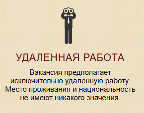

https://csssr.com/ru/jobs/qa-engineer


https://github.com/CSSSR/qa-engineer?tab=readme-ov-file
https://csssr.github.io/qa-engineer/
https://www.figma.com/design/CtJDsg3EvAYWFfY7bEMeKZ/QA-%D1%82%D0%B5%D1%81%D1%82?node-id=6-507&t=ZcyT9rePTvRTp2Np-0


1. **Соответствие верстки исходному макету и техническому заданию**

- Ширина  Контентная части 1001 вместо 1000
- Контентная часть не центрирована
# Первый блок 
1)  расстояния между буквами не соответствует макету. жирность  (letter-spacing, line-height, font-weight)
2) Отступу не соответствую макету 
3) ![[Pasted image 20241221104641.png]]
вместо текста использования фотография  это плохо для SEO - в хорошей практикой считается что на каждой странице должно быть **только один  H1** тэг

как на сайте

![[]]


как должно быть 
![[Pasted image 20241220174724.png]]

4) я бы добавил **ARIA атрибуты**  `aria-labelledby` и `aria-describedby`
```html
<section class="jobInfo" role="region" aria-labelledby="jobInfoHeading">
  <h1 id="jobInfoHeading">КРАТКОЕ СОДЕРЖАНИЕ ВАКАНСИИ</h1>
  <div class="remoteJob" role="article">
    <h1>УДАЛЕННАЯ РАБОТА</h1>
    <p>
      Вакансия предполагает исключительно удаленную работу. Место проживания и национальность не имеют никакого значения.
    </p>
  </div>

  <div class="schedule" role="article">
    <h1>12:00 — 21:00</h1>
    <p>
      Пятидневная рабочая неделя. <br> С понедельника по пятницу, 12:00 — 21:00 по московскому времени. Обратите внимание, что совмещать с другой работой не получится.
    </p>
  </div>

  <div class="comp" role="article">
    <h1>ПОТРЕБУЕТСЯ ХОРОШИЙ КОМПЬЮТЕР</h1>
    <p>
      Для работы желательно иметь не менее 8 Гб оперативной памяти, и интернет со скоростью не менее 10 МБит.<br>
      Желательно иметь смартфон.
    </p>
  </div>
</section>

```
5) для улучшения навигации при помощи TAB добавил бы  `tabindex`
```html
<h1 tabindex="0">УДАЛЕННАЯ РАБОТА</h1>
```


И так далее ;))
#  Проверка всё что я описал ранее на Фреймворке  Cypress

**Установи Node.js**:

- Зайди на [официальный сайт Node.js](https://nodejs.org/) и скачай LTS-версию.
- Установи Node.js с настройками по умолчанию.

**Установите зависимости**
```
npm i 
```

**запастите Cypress**
```js
npx cypress open
```